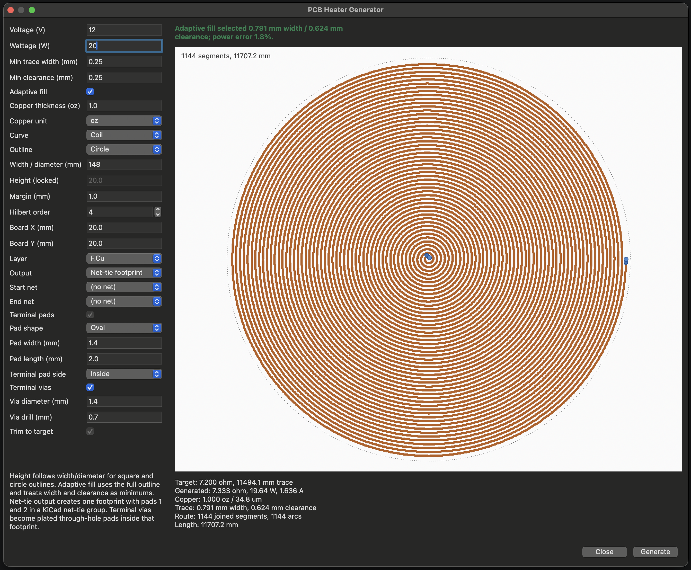

# PCB Heater Generator for KiCad 9

KiCad 9 PCB editor action plugin for generating PCB copper heater traces from voltage, wattage, copper thickness, and layout constraints.

The plugin computes the target resistance as `R = V^2 / P`, estimates the required copper length from trace width and copper thickness, and generates a previewable heater pattern before inserting it into the PCB.



## Features

- Generates serpentine, coil/spiral, and Hilbert-style heater traces.
- Supports rectangle, square, and circle heater outlines.
- Provides a wxPython preview dialog with live metrics and fit warnings.
- Supports copper thickness input in `oz` or `um`.
- Includes adaptive fill mode for automatically selecting trace width and clearance from minimum values.
- Reports when traces, terminal pads, or vias exceed the selected heater outline.
- Can generate a DRC-safe KiCad net-tie footprint with separate start and end nets.
- Can also generate direct board copper for quick experiments.
- Supports configurable terminal pad shape, size, side, and optional plated terminal vias.

## Requirements

- KiCad 9.x with Python scripting support.
- No external Python packages are required; the plugin uses KiCad's bundled `pcbnew` and wxPython APIs.

This plugin is written for KiCad 9's `pcbnew.ActionPlugin` API. It has been tested with KiCad 9.0.5.

## Installation

Download or clone this repository, then copy the `heater_generator` directory into KiCad's manual plugin folder. If you download the repository as a ZIP file, extract it first and copy only the `heater_generator` directory.

The installed layout should look like this:

```text
<KiCad plugins folder>/
  heater_generator/
    __init__.py
    action.py
    dialog.py
    generator.py
```

Default KiCad 9 manual plugin folders:

| OS | Plugin folder |
| --- | --- |
| Linux | `~/.local/share/kicad/9.0/scripting/plugins` |
| macOS | `~/Documents/KiCad/9.0/scripting/plugins` |
| Windows | `%HOME%\Documents\KiCad\9.0\scripting\plugins` |

These paths are from the [KiCad 9 PCB Editor documentation](https://docs.kicad.org/9.0/en/pcbnew/pcbnew.html#python-script-locations). If your installation uses a custom configuration location, open KiCad's PCB Editor scripting console and run:

```python
import pcbnew
print(pcbnew.PLUGIN_DIRECTORIES_SEARCH)
```

### Linux

```sh
git clone https://github.com/matteoscalabrini/KiCad-Heater-Generator.git
mkdir -p ~/.local/share/kicad/9.0/scripting/plugins
cp -R KiCad-Heater-Generator/heater_generator ~/.local/share/kicad/9.0/scripting/plugins/
```

For development, you can symlink instead of copying:

```sh
ln -s "$PWD/KiCad-Heater-Generator/heater_generator" ~/.local/share/kicad/9.0/scripting/plugins/heater_generator
```

### macOS

```sh
git clone https://github.com/matteoscalabrini/KiCad-Heater-Generator.git
mkdir -p ~/Documents/KiCad/9.0/scripting/plugins
cp -R KiCad-Heater-Generator/heater_generator ~/Documents/KiCad/9.0/scripting/plugins/
```

For development, you can symlink instead of copying:

```sh
ln -s "$PWD/KiCad-Heater-Generator/heater_generator" ~/Documents/KiCad/9.0/scripting/plugins/heater_generator
```

### Windows PowerShell

```powershell
git clone https://github.com/matteoscalabrini/KiCad-Heater-Generator.git
New-Item -ItemType Directory -Force "$HOME\Documents\KiCad\9.0\scripting\plugins"
Copy-Item -Recurse ".\KiCad-Heater-Generator\heater_generator" "$HOME\Documents\KiCad\9.0\scripting\plugins\heater_generator"
```

After installing, restart KiCad or refresh action plugins in the PCB Editor preferences. The action appears as `PCB Heater Generator` under `Tools > External Plugins`.

If the plugin does not appear, check that the `heater_generator` folder itself is directly inside one of KiCad's plugin search folders and contains `__init__.py`.

## Usage

1. Open a board in KiCad's PCB Editor.
2. Run `Tools > External Plugins > PCB Heater Generator`.
3. Enter the voltage, wattage, copper thickness, outline size, trace width, and clearance.
4. Select a curve and outline type.
5. Review the preview, generated resistance, power, length, and outline fit.
6. Click `Generate` to insert the heater.

For DRC-clean heaters that intentionally connect two nets, use `Output: Net-tie footprint`, then select `Start net` and `End net`. The plugin creates one board-only footprint with pads `1` and `2` in a KiCad net-tie group, and the heater copper is generated inside that footprint.

Use `Output: Board copper` only when you want loose PCB tracks/shapes on one net. Board copper output does not create a net-tie boundary for DRC.

## Controls

- `Height` is used only for rectangle outlines. Square and circle outlines lock height to the width/diameter value.
- `Copper thickness` can be entered in `oz` or `um`; calculations use micrometers internally.
- `Adaptive fill` treats trace width and clearance as minimum manufacturable values, then searches for a width/clearance combination that fills the selected outline and approaches the target resistance.
- `Output` selects between DRC-safe `Net-tie footprint` output and direct `Board copper` output.
- `Start net` and `End net` assign the two terminal pads in net-tie footprint output. In board copper output, only one net is used.
- `Outline fit` reports whether the copper trace, terminal pads, or vias exceed the selected outline. The preview outline turns red when copper spills outside the constraint.
- `Terminal pad side`, `Pad shape`, `Pad width`, and `Pad length` control endpoint pad placement and geometry.
- `Terminal vias` adds through-vias at both heater endpoints in board copper output. In net-tie footprint output, the terminal pads become plated through-hole pads using the configured via diameter and drill.

## Notes

- Resistance is an electrical estimate using nominal copper resistivity. Copper tolerance, plating variation, temperature coefficient, solder mask, airflow, substrate limits, and current density still need engineering review.
- Circle coil patterns are emitted as KiCad copper arcs where possible. Serpentine and Hilbert routes use straight segments.
- Net-tie footprint output uses KiCad footprint net-tie pad groups so DRC treats the heater start and end as an intentional short inside the generated footprint.
- KiCad 9 also has a newer IPC API, but this plugin currently uses the documented `pcbnew.ActionPlugin` API because it runs directly inside the PCB Editor and uses KiCad's embedded wxPython UI.

## Development

Run the generator tests with:

```sh
python3 -m unittest discover -s tests
```

The tests cover geometry generation and resistance calculations. KiCad-specific insertion code requires KiCad's bundled Python environment or manual testing inside KiCad.
